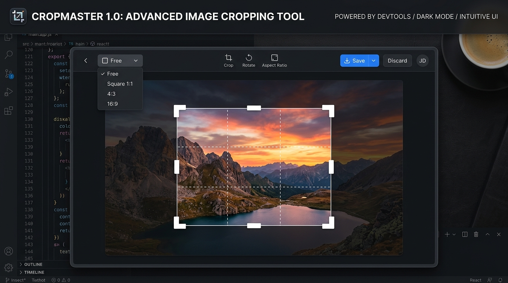

# Image Editor: Simple Crop

  

  <b>Simple, intuitive image cropping with Excel-style handles and direct overwrite saving.</b> 
  <i>Excel風のハンドル操作で直感的にトリミングし、元ファイルに直接上書き保存できるVS Code拡張機能</i>

  <a href="#english">English</a> •
  <a href="#日本語-japanese">日本語</a> •
  <a href="#简体中文-chinese">简体中文</a> •
  <a href="#한국어-korean">한국어</a> •
  <a href="#tiếng-việt-vietnamese">Tiếng Việt</a> •
  <a href="#deutsch-german">Deutsch</a> •
  <a href="#español-spanish">Español</a> •
  <a href="#français-french">Français</a> •
  <a href="#हिन्दी-hindi">हिन्दी</a> •
  <a href="#italiano-italian">Italiano</a> •
  <a href="#português-portuguese">Português</a> •
  <a href="#русский-russian">Русский</a>

---

## Preview / プレビュー

  

---

## English

### Overview
**Image Editor: Simple Crop** provides a familiar and intuitive cropping experience inspired by Microsoft Excel's crop tool. Instead of complicated photo editing menus, you can adjust top, bottom, left, right edges and corners individually, then press `Cmd+S` to overwrite the file in place immediately.

### Key Features
- **Excel-style 8 Handles**: 4 corner L-handles for diagonal resizing, and 4 edge bars for individual edge adjustments.
- **Instant Overwrite**: Overwrite the original image file directly with `Cmd + S` or the "Save & Overwrite" button.
- **Aspect Ratio Locking**: Switch easily between Free-form cropping and 1:1 (Square) mode.
- **Lossless & Transparency Preserved**: Keeps PNG/WebP alpha transparency and original resolution intact.
- **Supported Formats**: PNG, JPG, JPEG, WEBP, BMP.

### How to Use
1. Right-click any image file in the VS Code Explorer.
2. Select **`Image Editor: Simple Crop`**.
3. Drag the corner L-handles or edge bars to trim unwanted borders.
4. Press **`Cmd + S`** (or click "Save & Overwrite") to update your image.

### Shortcuts
| Shortcut | Action |
|---|---|
| **Cmd + S** / **Ctrl + S** | Save & Overwrite original image |
| **1** | Switch to 1:1 (Square) ratio |
| **F** | Switch to Free-form ratio |
| **R** | Reset crop box to full image |
| **Esc** | Close without saving |

---

## 日本語 (Japanese)

### 概要
**Image Editor: Simple Crop** は、Microsoft Excelの画像トリミングと同様の直感的な操作感を提供する画像切り抜き拡張機能です。余計な機能や複雑なレイヤー操作はなく、上下左右や四隅のハンドルを動かして `Cmd + S` を押すだけで、元画像に直接上書き保存できます。

### 主な特徴
- **Excel風の8方向ハンドル**: 斜め調整の「L字ハンドル」と、上下左右の辺を個別に詰められる「バーハンドル」を搭載。
- **ワンクリック上書き保存**: `Cmd + S` または保存ボタンで、元画像ファイルを即座に直接上書き。
- **比率切り替え**: アイコン作成に便利な「1:1（正方形）」と「自由比率」をワンタップ切替。
- **透過と高画質を維持**: PNG/WebPの透明度（アルファチャンネル）や解像度を損なわずに保存。
- **対応形式**: PNG, JPG, JPEG, WEBP, BMP。

### 使い方
1. エクスプローラーで画像ファイルを **右クリック**。
2. **`Image Editor: Simple Crop`** を選択。
3. ハンドルをドラッグしてトリミング範囲を調整（枠内ドラッグで位置移動）。
4. **`Cmd + S`** を押すと、元ファイルに上書き保存されます。

---

## 简体中文 (Chinese)

### 概述
**Image Editor: Simple Crop** 是一款轻量直观的图片裁剪扩展，完美还原了类似 Microsoft Excel 的裁剪体验。没有复杂的多层编辑，通过简单的边框手柄调整后，按下 `Cmd + S` 即可直接覆盖原图。

### 主要功能
- **Excel 风格 8 向手柄**：四角 L 型手柄支持对角缩放，四边居中条状手柄可单独裁剪上下左右边距。
- **一键覆盖保存**：通过 `Cmd + S` 或保存按钮，直接覆盖保存到原图片文件。
- **比例切换**：一键在自由比例与 1:1 正方形模式之间快速切换。
- **保留透明通道与原画质**：无损保留 PNG/WebP 的 Alpha 透明通道及高清分辨率。
- **支持格式**：PNG, JPG, JPEG, WEBP, BMP。

---

## 한국어 (Korean)

### 개요
**Image Editor: Simple Crop** 은 엑셀의 이미지 자르기와 같은 직관적인 조작감을 제공하는 간편한 이미지 크롭 확장 기능입니다. 복잡한 편집 툴 없이 상하좌우 및 모서리 핸들을 조정하고 `Cmd + S`를 누르면 원본 파일에 즉시 덮어씌워집니다.

### 주요 기능
- **엑셀 스타일 8방향 핸들**: 사각 L자 핸들 및 상하좌우 바 핸들로 손쉬운 영역 조절.
- **원클릭 덮어쓰기 저장**: `Cmd + S` 키로 원본 이미지에 바로 덮어쓰기 저장.
- **비율 고정 기능**: 자유 비율과 1:1 정방형 모드를 원터치로 전환.
- **투명도 및 화질 유지**: PNG/WebP 투명 알파 채널 및 고해상도를 완벽 유지.

---

## Tiếng Việt (Vietnamese)

### Tổng quan
**Image Editor: Simple Crop** mang đến trải nghiệm cắt xén ảnh trực quan như trong Microsoft Excel ngay bên trong VS Code. Bạn có thể kéo các cạnh và góc để điều chỉnh, sau đó nhấn `Cmd + S` để lưu ghi đè trực tiếp lên tệp gốc.

### Tính năng chính
- **8 tay cầm theo phong cách Excel**: 4 tay cầm chữ L ở góc và 4 thanh ở các cạnh giúp tinh chỉnh chính xác.
- **Lưu đè nhanh chóng**: Nhấn `Cmd + S` để ghi đè ngay lập tức lên ảnh gốc.
- **Tùy chọn tỉ lệ**: Chuyển đổi linh hoạt giữa Tự do (Free) và Vuông 1:1 (Square).
- **Giữ nguyên độ trong suốt (Alpha)**: Không làm mất chất lượng gốc và nền trong suốt của PNG/WebP.

---

## Deutsch (German)

### Übersicht
**Image Editor: Simple Crop** bietet ein vertrautes Zuschneideerlebnis wie in Microsoft Excel. Passen Sie Kanten und Ecken an und speichern Sie das Bild mit `Cmd + S` direkt über die Originaldatei.

### Hauptmerkmale
- **8 Griffe im Excel-Stil**: 4 L-Griffe an den Ecken und 4 Kantenleisten zum individuellen Zuschneiden.
- **Direktes Überschreiben**: Mit `Cmd + S` oder Tastendruck wird die Originaldatei sofort aktualisiert.
- **Seitenverhältnis sperren**: Schneller Wechsel zwischen Freiform und quadratischem Zuschnitt (1:1).
- **Transparenz bleibt erhalten**: Behält die ursprüngliche Qualität und PNG/WebP-Transparenz bei.

---

## Español (Spanish)

### Resumen
**Image Editor: Simple Crop** ofrece una experiencia de recorte intuitiva inspirada en Microsoft Excel dentro de VS Code. Ajusta los bordes superior, inferior y laterales, y presiona `Cmd + S` para sobrescribir el archivo original al instante.

### Características clave
- **8 controles estilo Excel**: 4 esquinas en forma de L y 4 barras en los bordes para un recorte preciso.
- **Sobrescribir al instante**: Guarda directamente sobre el archivo original con `Cmd + S`.
- **Modo 1:1 (Cuadrado) y Libre**: Alterna rápidamente la relación de aspecto.
- **Conserva la transparencia**: Mantiene el canal alfa y la calidad original en archivos PNG/WebP.

---

## Français (French)

### Aperçu
**Image Editor: Simple Crop** offre un outil de recadrage d'image intuitif inspiré de Microsoft Excel. Ajustez facilement les bords et les coins, puis appuyez sur `Cmd + S` pour écraser et sauvegarder directement le fichier source.

### Points forts
- **8 poignées de style Excel** : Poignées d'angle en L et barres latérales pour un contrôle optimal.
- **Écrasement direct** : Sauvegarde instantanée sur le fichier original via `Cmd + S`.
- **Rapport d'aspect** : Basculez entre le mode libre et le format carré 1:1.
- **Transparence conservée** : Conserve la résolution d'origine et la transparence alpha (PNG/WebP).

---

## हिन्दी (Hindi)

### विवरण
**Image Editor: Simple Crop** वीएस कोड के भीतर माइक्रोसॉफ्ट एक्सेल जैसी सरल और सहज इमेज क्रॉपिंग सुविधा प्रदान करता है। किसी भी बॉर्डर या कोने को खींचकर क्रॉप करें और `Cmd + S` दबाकर सीधे मूल फ़ाइल पर ओवरराइट करें।

### मुख्य विशेषताएं
- **एक्सेल-शैली के 8 हैंडल**: आसान आकार बदलने के लिए 4 कोने वाले L-हैंडल और 4 साइड बार।
- **त्वरित ओवरराइट**: `Cmd + S` से सीधे मूल छवि फ़ाइल पर सेव करें।
- **अनुपात नियंत्रण**: फ्री-फॉर्म और 1:1 (वर्ग) अनुपात के बीच आसानी से टॉगल करें।
- **पारदर्शिता सुरक्षित**: PNG/WebP छवियों में पारदर्शिता और गुणवत्ता बरकरार रहती है।

---

## Italiano (Italian)

### Panoramica
**Image Editor: Simple Crop** offre uno strumento di ritaglio semplice e intuitivo ispirato a Microsoft Excel. Regola i bordi e gli angoli in modo indipendente e premi `Cmd + S` per sovrascrivere direttamente il file originale.

### Caratteristiche principali
- **8 maniglie stile Excel**: Maniglie ad angolo a L e barre sui bordi per la massima precisione.
- **Sovrascrittura istantanea**: Salva direttamente sul file immagine originale con `Cmd + S`.
- **Rapporto 1:1 e Libero**: Passa facilmente dalla modalità libera a quella quadrata.
- **Mantiene la trasparenza**: Nessuna perdita di risoluzione o canale alfa per PNG e WebP.

---

## Português (Portuguese)

### Visão Geral
**Image Editor: Simple Crop** oferece uma experiência de corte direta e intuitiva, inspirada no Microsoft Excel. Ajuste as bordas e cantos individualmente e pressione `Cmd + S` para sobrescrever diretamente o arquivo original.

### Principais Recursos
- **8 alças estilo Excel**: 4 alças em L nos cantos e 4 barras laterais para ajuste fino.
- **Sobrescrita direta**: Salve e substitua o arquivo original instantaneamente com `Cmd + S`.
- **Proporção 1:1 e Livre**: Alterne rapidamente entre proporção livre e quadrada (1:1).
- **Preserva transparência e qualidade**: Mantém o canal alfa e resolução original de imagens PNG/WebP.

---

## Русский (Russian)

### Обзор
**Image Editor: Simple Crop** — это расширение для быстрой обрезки изображений в стиле Microsoft Excel прямо в VS Code. Настройте границы с помощью угловых и боковых маркеров и нажмите `Cmd + S`, чтобы мгновенно перезаписать исходный файл.

### Основные возможности
- **8 маркеров в стиле Excel**: Угловые L-маркеры и полосы на краях для точной подгонки.
- **Прямая перезапись**: Мгновенно сохраняет изменения в исходный файл по нажатию `Cmd + S`.
- **Переключение пропорций**: Быстрый выбор между свободным соотношением и квадратом 1:1.
- **Сохранение прозрачности**: Полностью сохраняет альфа-канал и исходное разрешение (PNG/WebP).

---

## License
MIT
